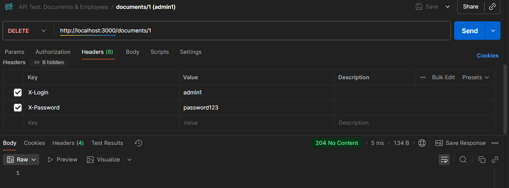

# Лабораторно-практична робота №3 ( Secure API Lab )

Цей проєкт демонструє роботу захищеного API на Node.js з використанням Express.  
API дозволяє управляти документами та співробітниками з контролем доступу за ролями (`user` та `admin`).  
Проєкт включає механізми аутентифікації, логування та обробки помилок, а також тестовий клієнт для перевірки всіх сценаріїв.

## Інструкції з запуску

- Встановіть залежності: npm install

- Запустіть сервер: npm start

- Запустіть тестовий клієнт: npm test

<h2>Опис реалізованих ендпоінтів API</h2> 

 <table>
  <thead>
    <tr>
      <th>Метод</th>
      <th>URL</th>
      <th>Заголовки (Headers)</th>
      <th>Тіло (Body)</th>
      <th>Очікуваний статус</th>
      <th>Примітка</th>
    </tr>
  </thead>
  <tbody>
    <tr>
      <td>GET</td>
      <td>/documents</td>
      <td>-</td>
      <td>-</td>
      <td>401 Unauthorized</td>
      <td>Спроба доступу без аутентифікації.</td>
    </tr>
    <tr>
      <td>GET</td>
      <td>/employees</td>
      <td>X-Login: user1 X-Password: password123</td>
      <td>-</td>
      <td>403 Forbidden</td>
      <td>Спроба доступу до адмін-ресурсу з роллю 'user'.</td>
    </tr>
    <tr>
      <td>GET</td>
      <td>/documents</td>
      <td>X-Login: user1 X-Password: password123</td>
      <td>-</td>
      <td>200 OK</td>
      <td>Успішне отримання даних з роллю 'user'.</td>
    </tr>
    <tr>
      <td>GET</td>
      <td>/employees</td>
      <td>X-Login: admin1 X-Password: password123</td>
      <td>-</td>
      <td>200 OK</td>
      <td>Успішне отримання даних з роллю 'admin'.</td>
    </tr>
    <tr>
      <td>POST</td>
      <td>/documents</td>
      <td>X-Login: user1 X-Password: password123</td>
      <td>{ "title": "Test Doc", "content": "..." }</td>
      <td>201 Created</td>
      <td>Успішне створення ресурсу.</td>
    </tr>
    <tr>
      <td>POST</td>
      <td>/documents</td>
      <td>X-Login: user1 X-Password: password123</td>
      <td>{ "content": "..." }</td>
      <td>400 Bad Request</td>
      <td>Помилка валідації (відсутнє поле title).</td>
    </tr>
    <tr>
      <td>DELETE</td>
      <td>/documents/1</td>
      <td>X-Login: admin1 X-Password: password123</td>
      <td>-</td>
      <td>204 No Content</td>
      <td>Успішне видалення. Відповідь не має тіла.</td>
    </tr>
    <tr>
      <td>GET</td>
      <td>/non-existent</td>
      <td>X-Login: admin1 X-Password: password123</td>
      <td>-</td>
      <td>404 Not Found</td>
      <td>Звернення до неіснуючого маршруту.</td>
    </tr>
  </tbody>
</table>

# Перевірка роботи API через Postman

Нижче наведено скріншоти перевірки всіх основних сценаріїв роботи API: успішні запити та запити, що повертають помилки і не тільки.

## GET /documents (без авторизації)
Спроба отримати список документів без авторизації.

  

## GET /employees (користувач user1)
Спроба доступу до адмін-ресурсу зі звичайною роллю користувача.

  

## GET /documents (користувач user1)
Успішне отримання документів для звичайного користувача.

  

## GET /employees (адміністратор admin1)
Успішне отримання списку співробітників адміністратором.

  

## POST /documents (користувач user1, валідні дані)
Створення нового документа.

  

## POST /documents (користувач user1, відсутнє поле title)
Помилка валідації при створенні документа.

  

## DELETE /documents/1 (адміністратор admin1)
Успішне видалення документа адміністратором.

  

## GET /non-existent (адміністратор admin1)
Звернення до неіснуючого маршруту.

  

## npm test (запуск скрипта test-client.js)
Скрипт виконує тести для всіх ендпоінтів і виводить очікувані результати.

  

  

# Висновок

У ході виконання лабораторної роботи було розроблено безпечний REST API на базі Node.js та Express з аутентифікацією користувачів та ролями доступу. Було реалізовано основні ендпоінти для роботи з документами та співробітниками, включаючи GET, POST та DELETE методи.

Для перевірки коректності роботи API було проведено тестування трьома способами:  
1. **Через браузер** - підтверджено, що доступ без заголовків аутентифікації блокується.  
2. **Через Postman** - перевірено всі сценарії успішних запитів та помилок (401, 403, 404).  
3. **Через Node.js скрипт** `test-client.js` - автоматично протестовано ключові ендпоінти для користувача та адміністратора.

Усі ендпоінти працюють відповідно до специфікацій, а скрипт тестування підтвердив правильність статусів відповідей та передачі даних. Репозиторій на GitHub відображає хронологію виконання роботи з мінімум п’яти змістовних комітів, а структура файлів відповідає вимогам проєкту.

Робота демонструє розуміння принципів побудови REST API, використання ролей і аутентифікації, а також навички тестування та документування API. Проєкт готовий до подальшого розширення та інтеграції додаткових функціональних можливостей.
